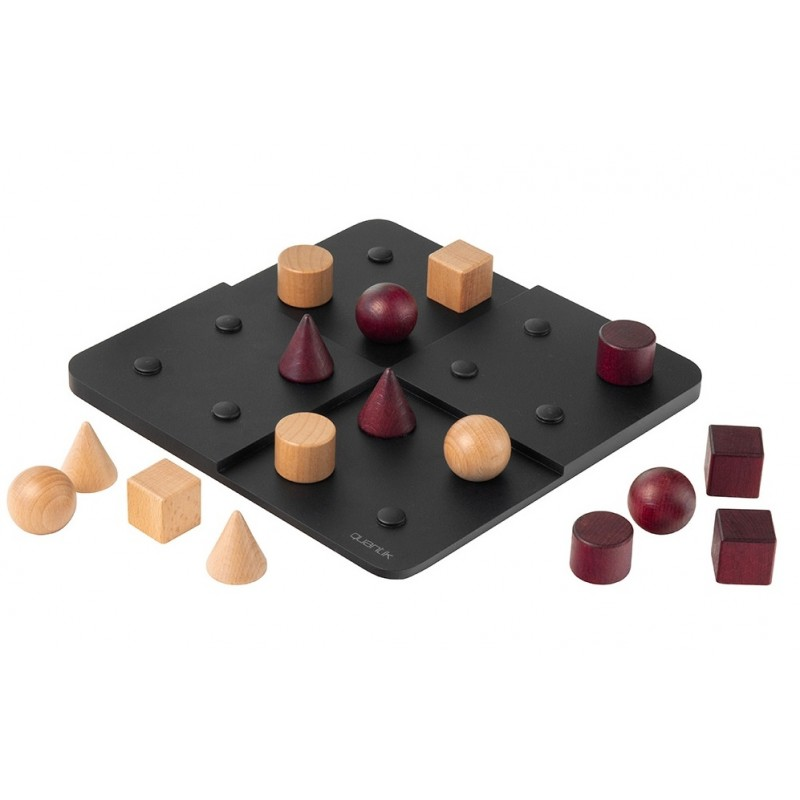

# Projet-Python

Quantik Game

 

Membres du groupe :

-         Maxime Lits

-         Matthew Everard

-         Charlier François

Explication :

Quantik est un jeu de société tel que puissance 4 ou le but d’aligner 4 formes différentes soit en vertical, horizontal ou dans une même zone en sachant que le plateau fait 4 cases par 4 cases et qu’une zone est un coin du plateau de 2 cases sur 2 cases. C’est un jeu qui se joue à un joueur contre un joueur.

Nous aimerions le rendre jouable en ligne avec une interface graphique qui ressemble au vrai plateau.

